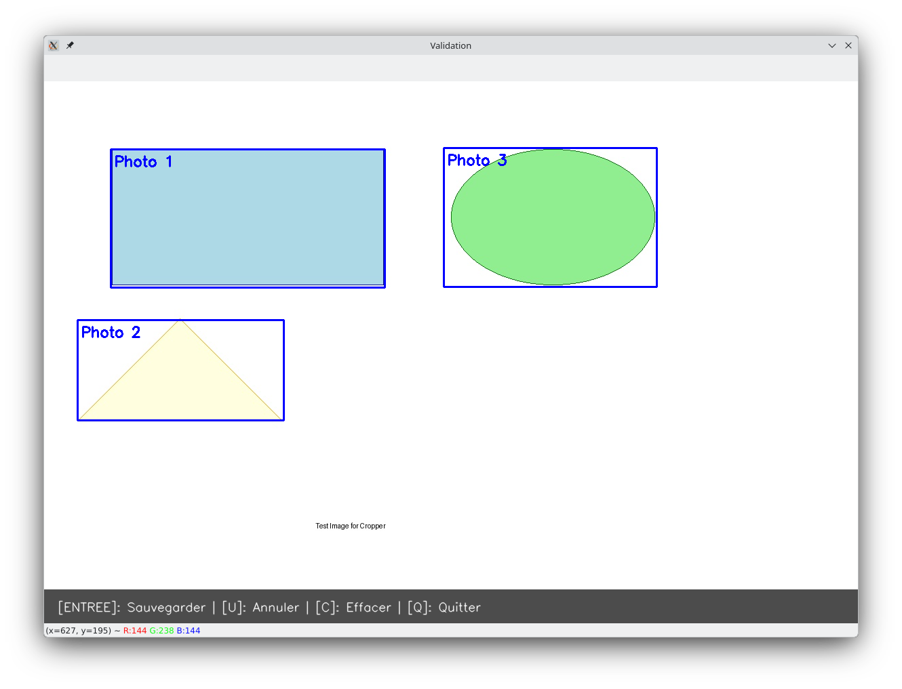

# Balena Photo Cropper 📸✂️
Balena Photo Cropper is a multi-container solution for Raspberry Pi 3 designed to automate the process of cropping scanned analog photo contact sheets.


[](https://dashboard.balena-cloud.com/deploy?repoUrl=https://github.com/b23prodtm/balena-photo-cropper)

🛠 Architecture

Cropper Service (Python/OpenCV): A Flask API that processes images to detect contours and extract individual photos with auto-rotation for vertical shots.

Web Service (CakePHP): A user-friendly frontend for uploading, previewing, and managing your digitalized library.

🔧 Prerequisites

A balenaCloud account.

balenaCLI installed on your machine.

A Raspberry Pi 3 (or higher).



📖 Usage

Once deployed, enable the Public Device URL in your balenaCloud dashboard. Access the provided URL to start uploading your .jpg scans. You can also use the interactive tool in the tools/ folder for local manual cropping.

```bash Linux
tools/launcher.sh tests/images/test_image.jpg --output result.jpg
```
```bash macOS
tools/launcher.command tests/images/test_image.jpg --output result.jpg
```
```cmd windows
tools/launcher.bat tests/images/test_image.jpg --output result.jpg
```

## 🚀 Installation

1. **Clone via SSH** : `git clone git@github.com:votre-utilisateur/balena-photo-cropper.git`
2. **Push vers Balena** : `balena push <fleet_name>`

---
**Author**: [www.b23prodtm.info](https://www.b23prodtm.info) | **License**: Apache v2
